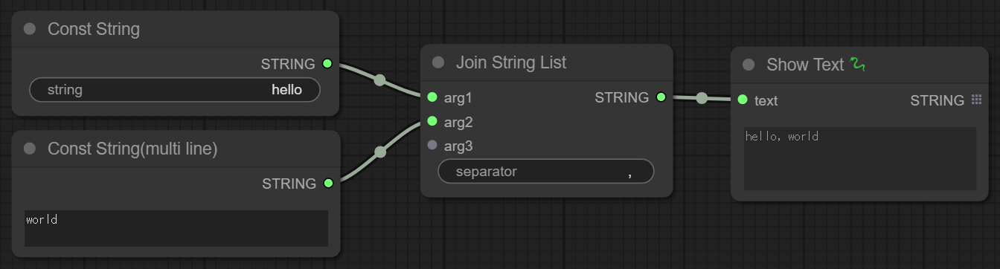
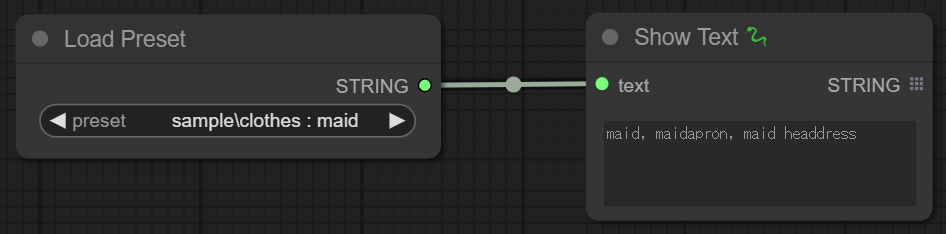
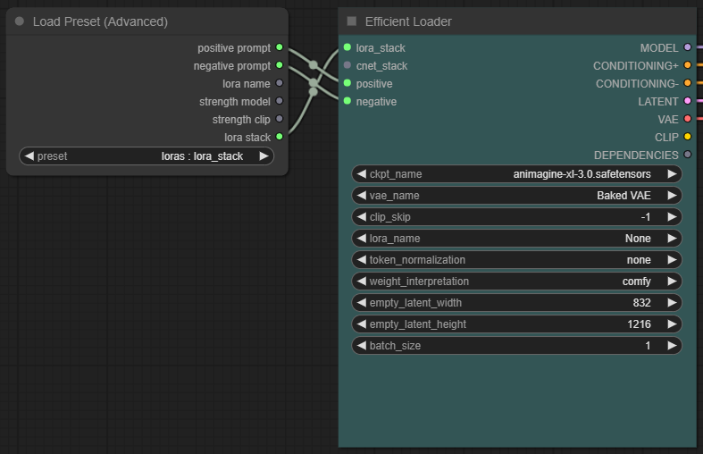
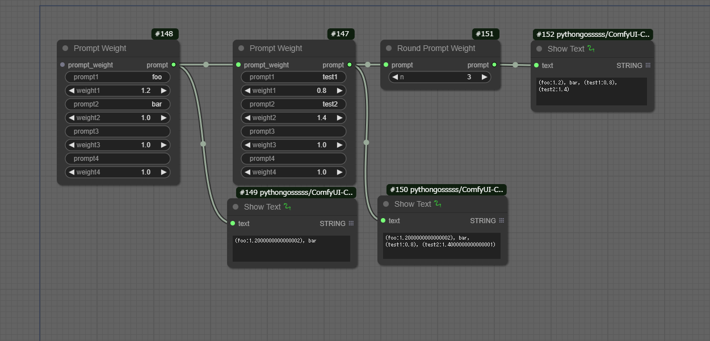
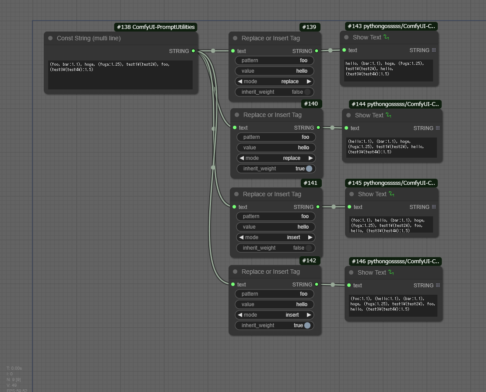

# ComfyUI-PromptUtilities
  
日本語版READMEは[こちら](README.jp.md)。

- Custom node for [ComfyUI](https://github.com/comfyanonymous/ComfyUI).
- Add useful nodes related to prompt.

## Installation
```
cd <ComfyUI directory>/custom_nodes
git clone https://github.com/nkchocoai/ComfyUI-PromptUtilities.git
```

## Nodes
### Join String List (Experimental)
- Outputs string which are the input `argN` strings concatenated with `separator`.
- There may be some bugs as we have not been able to check the operation very well.

  

### Format String (Experimental)
- Output string containing the input `argN` embedded in a `prompt`.
- In the `prompt`, `[N]` is replaced by the value of `argN`.
- There may be some bugs as we have not been able to check the operation very well.

  

### Load Preset
- Outputs the prompt for the selected preset.
- The presets are listed in a CSV file located in the [presets](presets) directory.
- [Easy Prompt Selector](https://github.com/blue-pen5805/sdweb-easy-prompt-selector?tab=readme-ov-file#customization) yml file is also partially supported.



### Load Preset (Advanced)
- Outputs the following values for the selected preset.
  - Positive prompt
  - Negative prompt
  - LoRA and its intensity
  - LoRA Stack (for [Efficiency Nodes](https://github.com/jags111/efficiency-nodes-comfyui))
- The presets are listed in a JSON file located in the [advanced_presets](advanced_presets) directory.




### Random Preset / Random Preset (Advanced) (Experimental)
- Outputs preset values randomly selected from within the selected file.
- There may be some bugs as we have not been able to check the operation very well.

### Const String
- Outputs the input string.

### Const String(multi line)
- Outputs the input string.
- You can input the string in multiple lines.

### Prompt Weight
- Outputs a weighted string for each `prompt`.


### Round Prompt Weight
- Round `prompt` weights.

### Replace or Insert Tag
- Replace (`mode`=replace) or append (`mode`=insert) the `value` to the tag matching the `pattern`.


## Misc
- Renaming [config.ini.example](config.ini.example) to `config.ini` will output Wildcard format text files from the presets placed in the [presets](presets) directory to the directory specified by `output_csv_presets_as_wildcards`.

## Recommended extensions
- [ComfyUI-Custom-Scripts](https://github.com/pythongosssss/ComfyUI-Custom-Scripts)
  - [Preset Text](https://github.com/pythongosssss/ComfyUI-Custom-Scripts?tab=readme-ov-file#preset-text) : Load a preset of text like the "Load Preset" node. And save the preset on ComfyUI.
  - [Show Text](https://github.com/pythongosssss/ComfyUI-Custom-Scripts?tab=readme-ov-file#show-text) : Displays input string.
  - [String Function](https://github.com/pythongosssss/ComfyUI-Custom-Scripts?tab=readme-ov-file#string-function) : Append or replace strings.
- [ComfyUI-Impact-Pack](https://github.com/ltdrdata/ComfyUI-Impact-Pack)
  - [Wildcard](https://github.com/ltdrdata/ComfyUI-extension-tutorials/blob/Main/ComfyUI-Impact-Pack/tutorial/ImpactWildcard.md) : Choose random prompt from text files.
- [UE Nodes](https://github.com/chrisgoringe/cg-use-everywhere)
  - Anything Everywhere : Outputs the input value to unconnected inputs of other nodes. Used in [img/ex_preset_adv_01.png](img/ex_preset_adv_01.png).
