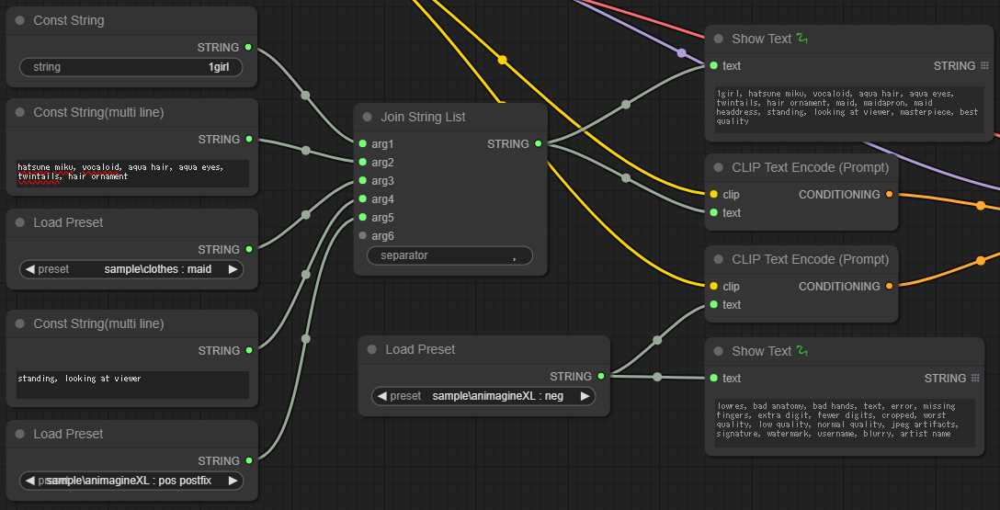
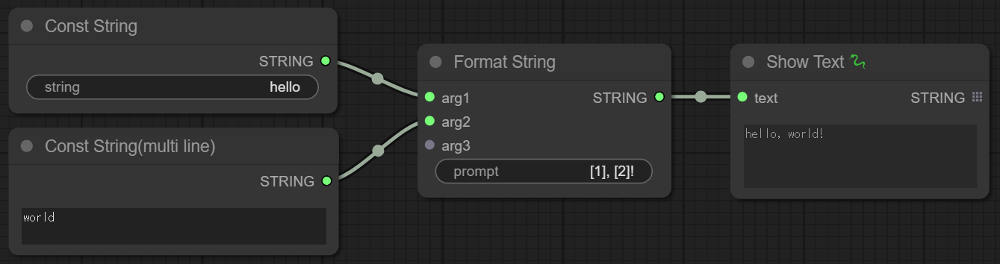

# ComfyUI-PromptUtilities
  
日本語版READMEは[こちら](README.jp.md)。

- Custom node for [ComfyUI](https://github.com/comfyanonymous/ComfyUI).
- Add useful nodes related to prompt.

## Installation
```
cd <ComfyUI directory>/custom_nodes
git clone https://github.com/nkchocoai/ComfyUI-PromptUtilities.git
```

## Nodes
### Join String List
- Outputs a list of strings which are the input `argN` strings concatenated with `separator`.

  

### Format String
- Format String Output a string containing the input `argN` embedded in a `prompt`.
- In the `prompt`, `[N]` is replaced by the value of `argN`.

  

### Load Preset
- Outputs the prompt for the selected preset.
- The presets are listed in a CSV file located in the [presets](presets) directory.


### Const String
- Outputs the input string.

### Const String(multi line)
- Outputs the input string.
- You can input the string in multiple lines.
